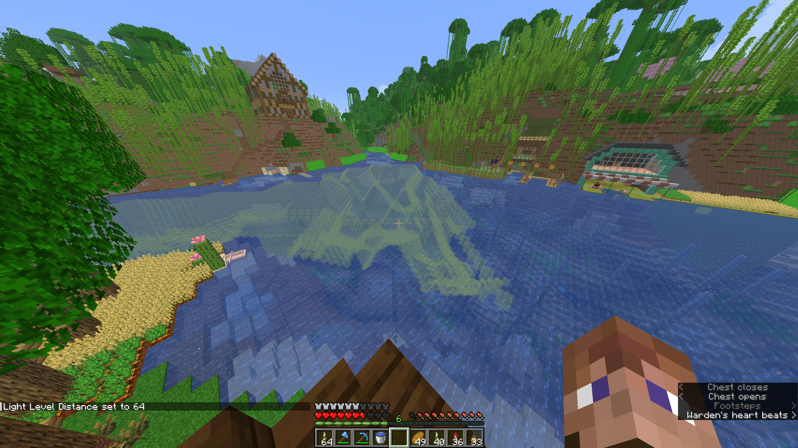
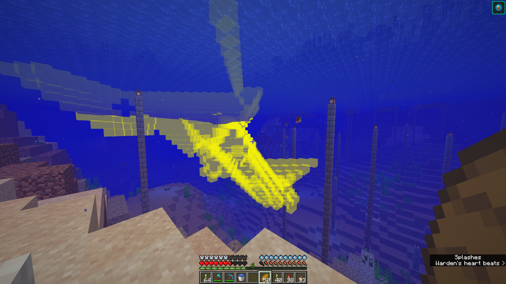

# Water-Light-Level

🌊**Water Light Level** is a **client-side Fabric mod** that visualizes **underwater blocks whose light level is below a configurable threshold**.

It renders a translucent **aura** around qualifying water blocks, making it easy to:
- spot **drowned-safe areas**
- identify **dark underwater regions**
- explore and debug **underwater lighting**

---

## ✨ Features

- 🔦 Highlights water blocks **below a chosen light level**
- 📏 Configurable **scan distance**
- 🎨 Customizable **aura color (ARGB)**
- ⌨ Toggle the aura on/off instantly
- ⌨️ Toggle the aura via a keystroke

---

---

## 🧭 Commands

All commands are under:

`/waterlightlevel`

### Light Level

`/waterlightlevel lightlevel <level>`
`/waterlightlevel lightlevel`

Sets or gets the **maximum light level** a water block may have to be highlighted.

---

### Scan Distance

`/waterlightlevel distance <distance>`
`/waterlightlevel distance`

Controls how far around the player the mod scans for water blocks.

---

### Aura Color (ARGB)

`/waterlightlevel color_argb <alpha><red><green><blue>` 
`/waterlightlevel color_argb`

Customize the aura color and transparency. Value need to be in HEX.

---

### Toggle

`/waterlightlevel toggle`

Or just use the toggle keybind (`L` by default)

Turns the aura **on or off**.

---

---

# Links

[Modrinth](https://modrinth.com/mod/water-light-level)

---

## 📦 Requirements

- **Minecraft**: 1.21.11  
- **Loader**: Fabric  
- **Fabric API**: required  
- **Client-side only** (safe to use on servers)

---

## 🧑‍💻 License

MIT
